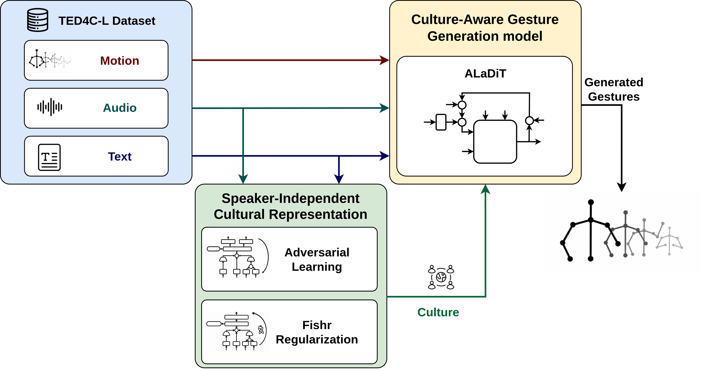

# SICAGE

<p align="center">
  
</p>

This is the official implementation of **"SICAGE: Speaker-Independent Culture-Aware Gesture Generation using TED4C-L Dataset,"**
accepted at ECCV 2026. The authors are Ariel Gjaci, Antonio Sgorbissa, and Vittorio Murino.

**Paper:** [arXiv:2606.30001](https://arxiv.org/abs/2606.30001) · **Project page:** [arielgjaci.com/sicage](https://arielgjaci.com/sicage/) · **Dataset:** [ariel-95/TED4C-L](https://huggingface.co/datasets/ariel-95/TED4C-L)

## Contents

- [Overview](#overview)
- [Repository map](#repository-map)
- [Requirements](#what-you-need)
- [Environments](#environments)
- [Recommended shell variables](#recommended-shell-variables)
- [Result-to-run map](#result-to-run-map)
- [Paper reproduction: end-to-end](#paper-reproduction-end-to-end)
  - [Step 1: Recreate and download the TED playlists](#step-1-recreate-and-download-the-four-ted-playlists)
  - [Step 2: Extract 3D poses](#step-2-extract-3d-poses)
  - [Step 3: Convert raw poses to clean 6D motion](#step-3-convert-raw-poses-to-clean-6d-motion)
  - [Step 4: Build the raw motion-only LMDB](#step-4-build-the-raw-motion-only-lmdb)
  - [Step 5: Train and validate the motion VQ-VAE](#step-5-train-and-validate-the-motion-vq-vae)
  - [Step 6: Build the full multimodal LMDB](#step-6-build-the-full-multimodal-lmdb)
  - [Step 7: Train the speaker-independent culture encoders](#step-7-train-the-speaker-independent-culture-encoders)
  - [Step 8: Train SICAGE and ALaDiT ablations](#step-8-train-sicage-and-all-aladit-ablations)
  - [Step 9: Evaluate the generator](#step-9-evaluate-the-generator)
  - [Step 10: Train and evaluate baselines](#step-10-train-and-evaluate-the-baselines)
  - [Step 11: Create qualitative images and videos](#step-11-create-images-and-videos-for-qualitative-analysis-using-bark)
  - [Step 12: Run the user study](#step-12-create-run-and-analyze-the-user-study)
- [Practical notes and limitations](#practical-notes-and-limitations)
- [Citation](#citation)

## Overview

The full pipeline follows these steps:

1. Download TED playlists with video, audio, and subtitles.
2. Extract 3D upper-body poses from video.
3. Clean the poses and convert them to 6D motion windows.
4. Build LMDB datasets for motion-only VQ-VAE training and downstream multimodal training.
5. Train a VQ-VAE codebook over motion.
6. Train speaker-independent culture encoders with Fishr or adversarial learning.
7. Train and evaluate the gesture generator (ALaDiT).
8. Produce qualitative videos and figures, and prepare the user-study website.

SICAGE learns cultural representations from audio and text by treating each speaker as a separate domain. The goal is to keep the embeddings discriminative for cultural source groups while reducing dependence on individual gesturing style. ALaDiT then conditions on those embeddings, speech context, and a short motion seed to synthesize co-speech gestures.

TED4C-L contains **106.45 hours** from **764 speakers** in **4 cultural groups** (India, Italy, Japan, and Turkey). Motion is sampled at **15 FPS** and divided into **659,454 five-second samples** with a **0.5-second stride**.

**Dataset release.** The public TED4C-L release is hosted on Hugging Face at [`ariel-95/TED4C-L`](https://huggingface.co/datasets/ariel-95/TED4C-L). It contains derived numeric motion, audio, and text representations, but no raw video, raw audio, readable subtitles, or transcript strings. This repository provides the source video IDs and the reconstruction pipeline for users who can access the source material.

## Reproducing the Paper

The commands below cover the complete workflow, including ALaDiT NC/ADV/FI, the OneHot, NoDG, and NoAlign ablations, MDM NC/ADV/FI, DSG+ NC/ADV/FI/FI+Align, evaluation, qualitative results, and the user study.

## Repository Map

- `TED4CL/`: playlist download, pose extraction, pose cleanup, text and audio processing, and dataset analysis.
- `dataset.py`: LMDB dataset building, metadata generation, split creation, and dataloaders.
- `vq_vae/`, `train_codebook.py`, `visualize_vqvae_data.py`: motion codebook training and visualization.
- `culture_encoder/`, `run_culture_classifier.py`: speaker-independent culture encoding with adversarial learning or Fishr.
- `mdm_generator/`, `train_hierarchical_mdm.py`, `test_hierachical_mdm.py`: SICAGE generator training and evaluation.
- `diffustylegesture_and_mdm/`: MDM and DiffuseStyleGesture+ training on TED4C-L.
- `inference_test.py`: qualitative multilingual timeline figure generation using Bark.
- `user_study/`: full creation of the user-study website.
- `comparison_video_prepare.py`: video creation for comparing generative models with real motion.

## What You Need

To reproduce the paper from raw videos, provide:

- a YouTube OAuth secret at `TED4CL/client_secret.json` for private-playlist access,
- a cookies file or browser cookies for `yt-dlp` to download videos,
- four YouTube playlists reconstructed from `TED4CL/playlist_video_ids.json`,
- a local `mmpose/` checkout with the configs referenced by `TED4CL/extract_poses.py`,
- MMPose detector, 2D pose, and MotionBERT checkpoints,
- the downloaded TED videos/subtitles/audio,
- any trained checkpoints you want to evaluate or visualize;
- alternatively, a small adaptation to `TED4CL/download_videos.py` that downloads the IDs in `TED4CL/playlist_video_ids.json` directly, without recreating YouTube playlists.

If you want to use the released LMDB dataset instead of rebuilding it from raw videos, download it from Hugging Face:

```bash
python -m pip install -U "huggingface_hub[hf_xet]>=0.36.2,<1.0"
export RELEASE_DATASET="/abs/path/to/TED4C-L"
python - <<'PY'
import os
from huggingface_hub import snapshot_download
path = snapshot_download(
    repo_id="ariel-95/TED4C-L",
    repo_type="dataset",
    local_dir=os.environ["RELEASE_DATASET"],
)
print(path)
PY
```

Then set:

```bash
export FULL_DATASET="$RELEASE_DATASET"
export FULL_META="$FULL_DATASET/metadata"
```

The released LMDB can be used for culture-encoder training, generator training,
and quantitative evaluation once the matching VQ-VAE checkpoint is available.
The raw reconstruction, qualitative rendering, and user-study asset scripts still
need the playlist/video folder tree because they read processed motion files,
scene metadata, and rendered media outside the LMDB.

## Environments

The project is easiest to reproduce with **two Python environments**.

### 1. Download Environment (Python 3.10)

Use this only for TED playlist download and subtitle retrieval.

```bash
python3.10 -m venv .venv-download
source .venv-download/bin/activate
python -m pip install --upgrade pip
python -m pip install -r requirements-download-py310.txt
```

System packages you still need:

- `ffmpeg`
- a browser cookie export or `--cookies-from-browser`
- `TED4CL/client_secret.json`

### 2. Main Environment (Python 3.8)

This is the main environment for MMPose extraction, dataset building, training, evaluation, and rendering.

```bash
python3.8 -m venv .venv-main
source .venv-main/bin/activate
python -m pip install --upgrade pip
python -m pip install -r requirements-main-py38.txt
python -m mim install "mmcv==2.0.1" "mmdet==3.1.0" "mmpose==1.1.0"
```

### 3. Optional MediaPipe Environment

`TED4CL/extract_poses.py` also supports `--backend mediapipe`, but that is **not** used to create TED4C-L.
If you want it, use Python `3.9+` in a separate environment and install `mediapipe` there.

## Recommended Shell Variables

Run every command from the repository root. The two Fishr paths are intentionally separate: `FISHR_RUN` is the multimodal `culclI` encoder used to condition a generator, while `CE_FISHR_RUN` is the motion-only `culclA` classifier used for CE evaluation.

```bash
export REPO_ROOT="$PWD"
export NUMBA_CACHE_DIR="$REPO_ROOT/.cache/numba"
export MPLCONFIGDIR="$REPO_ROOT/.cache/matplotlib"
mkdir -p "$NUMBA_CACHE_DIR" "$MPLCONFIGDIR"

export PLAYLISTS_ROOT="/abs/path/to/ted4cl_playlists"
export MOTION_DATASET="$PLAYLISTS_ROOT/motion_only_dataset"
export MOTION_META="$MOTION_DATASET/metadata"
export FULL_DATASET="$PLAYLISTS_ROOT/full_dataset"
export FULL_META="$FULL_DATASET/metadata"
export SICAGE_DATASET_ROOT="$PLAYLISTS_ROOT"

export VQ_RUN="$REPO_ROOT/vq_vae/output/train_codebook"
export ADV_RUN="$REPO_ROOT/culture_encoder/adversarial_train"
export FISHR_RUN="$REPO_ROOT/culture_encoder/fishr_train/full_data_culclI"
export CE_FISHR_RUN="$REPO_ROOT/culture_encoder/fishr_train/full_data_culclA"
export NODG_ENCODER_RUN="$REPO_ROOT/culture_encoder/fishr_train/full_data_culclI_no_dg"

export VQ_CHECKPOINT="$VQ_RUN/codebook_checkpoint_best.bin"
export FISHR_CHECKPOINT="$FISHR_RUN/model_best.pt"
export CE_FISHR_CHECKPOINT="$CE_FISHR_RUN/model_best.pt"
export NODG_ENCODER_CHECKPOINT="$NODG_ENCODER_RUN/model_best.pt"
export ADV_CHECKPOINT="$ADV_RUN/culclI/no_weighted_loss/train_culclI/culclI_checkpoint_best_sep_people_adv_train.bin"

export NO_CULTURE_RUN="$REPO_ROOT/mdm_runs/no_culture_500k"
export FISHR_MDM_RUN="$REPO_ROOT/mdm_runs/fishr_culclI_500k"
export ADV_MDM_RUN="$REPO_ROOT/mdm_runs/adv_culclI_500k"
export ONEHOT_MDM_RUN="$REPO_ROOT/mdm_runs/one_hot_culture_500k"
export NODG_MDM_RUN="$REPO_ROOT/mdm_runs/no_dg_culclI_500k"
export NOALIGN_MDM_RUN="$REPO_ROOT/mdm_runs/fishr_culclI_no_alignment_500k"

export BASELINE_MDM_RUN="$REPO_ROOT/mdm_runs/baseline_mdm"
export BASELINE_DSGP_RUN="$REPO_ROOT/mdm_runs/baseline_diffustylegesture_plus"
export BASELINE_MDM_FISHR_RUN="$REPO_ROOT/mdm_runs/baseline_mdm_fishr"
export BASELINE_MDM_ADV_RUN="$REPO_ROOT/mdm_runs/baseline_mdm_adversarial"
export BASELINE_DSGP_FISHR_RUN="$REPO_ROOT/mdm_runs/baseline_diffustylegesture_plus_fishr"
export BASELINE_DSGP_ADV_RUN="$REPO_ROOT/mdm_runs/baseline_diffustylegesture_plus_adversarial"
export BASELINE_DSGP_FISHR_ALIGN_RUN="$REPO_ROOT/mdm_runs/baseline_diffustylegesture_plus_fishr_align"
```

### Result-to-Run Map

Every reported row is covered below. All generator runs use the same speaker-disjoint split, seed 10, 50 diffusion steps, and 500,000 training updates. Evaluation uses validation-FGD checkpoint selection followed by 10 matched test runs of 3,000 samples each.

| Reported row | Training recipe | Run directory |
|---|---|---|
| ALaDiT/NC | Step 8.1 | `$NO_CULTURE_RUN` |
| ALaDiT/FI | Step 8.2 | `$FISHR_MDM_RUN` |
| ALaDiT/ADV | Step 8.3 | `$ADV_MDM_RUN` |
| ALaDiT/OneHot | Step 8.4 | `$ONEHOT_MDM_RUN` |
| ALaDiT/NoDG | Step 7 NoDG recipe and Step 8.5 | `$NODG_MDM_RUN` |
| ALaDiT/NoAlign | Step 8.6 | `$NOALIGN_MDM_RUN` |
| MDM NC/FI/ADV | Steps 10.1 and 10.2A | `$BASELINE_MDM_*_RUN` |
| DSG+ NC/FI/ADV | Steps 10.2 and 10.2A | `$BASELINE_DSGP_*_RUN` |
| DSG+/FI+Align | Step 10.2B | `$BASELINE_DSGP_FISHR_ALIGN_RUN` |

The row names match the paper tables: `NC` means no culture conditioning, `FI` means Fishr, `ADV` means adversarial domain generalization, `NoDG` uses the FI audio/text backbone with Fishr's domain-generalization penalty disabled, and `NoAlign` removes ALaDiT's explicit motion/context alignment losses.

Model-comparison rows from the main paper, reported as mean ± standard deviation over 10 matched test runs:

| Model | FGD ↓ | CE F1 (%) ↑ | BAS (%) ↑ | SRGR (%) ↑ | Diversity ↑ |
|---|---:|---:|---:|---:|---:|
| DSG+/NC | 2.76 ± 0.31 | 41.51 ± 0.78 | 22.48 ± 0.11 | 68.17 ± 0.24 | 108.85 ± 0.63 |
| DSG+/ADV | 4.81 ± 0.43 | **42.21 ± 0.96** | 22.58 ± 0.19 | 66.78 ± 0.32 | 107.78 ± 0.71 |
| DSG+/FI | 4.89 ± 0.40 | 40.67 ± 1.31 | 22.48 ± 0.15 | **68.46 ± 0.29** | 108.85 ± 1.14 |
| DSG+/FI+Align | **2.52 ± 0.21** | 39.80 ± 0.56 | **22.67 ± 0.16** | 65.17 ± 0.24 | **111.13 ± 1.07** |
| MDM/NC | 15.58 ± 1.43 | 38.57 ± 0.80 | 22.52 ± 0.14 | 51.62 ± 0.22 | 107.62 ± 1.08 |
| MDM/ADV | 13.67 ± 1.17 | 38.92 ± 0.93 | 22.59 ± 0.13 | **52.25 ± 0.25** | 105.92 ± 0.84 |
| MDM/FI | **7.59 ± 0.59** | **47.09 ± 0.79** | **22.59 ± 0.17** | 51.86 ± 0.24 | **109.37 ± 0.74** |
| ALaDiT/NC | 1.60 ± 0.18 | 43.41 ± 1.10 | 22.51 ± 0.15 | 67.72 ± 0.23 | 109.50 ± 0.68 |
| ALaDiT/ADV | 1.53 ± 0.17 | 42.71 ± 0.95 | 22.45 ± 0.17 | 67.57 ± 0.27 | **111.75 ± 0.71** |
| ALaDiT/FI | **1.03 ± 0.15** | **44.61 ± 0.95** | **22.63 ± 0.22** | **68.09 ± 0.25** | 110.27 ± 0.70 |

ALaDiT ablations from the main paper:

| Model | FGD ↓ | CE F1 (%) ↑ | BAS (%) ↑ | SRGR (%) ↑ | Diversity ↑ |
|---|---:|---:|---:|---:|---:|
| ALaDiT/OneHot | 1.63 ± 0.23 | 43.73 ± 1.13 | 22.51 ± 0.17 | 67.63 ± 0.25 | **111.79 ± 0.58** |
| ALaDiT/NoDG | 1.56 ± 0.22 | 43.18 ± 1.20 | 22.51 ± 0.23 | 67.76 ± 0.23 | 111.60 ± 0.71 |
| ALaDiT/NoAlign | 1.36 ± 0.16 | 43.37 ± 0.91 | 22.58 ± 0.17 | **68.17 ± 0.23** | 111.10 ± 0.77 |
| ALaDiT/NC | 1.60 ± 0.18 | 43.41 ± 1.10 | 22.51 ± 0.15 | 67.72 ± 0.23 | 109.50 ± 0.68 |
| ALaDiT/ADV | 1.53 ± 0.17 | 42.71 ± 0.95 | 22.45 ± 0.17 | 67.57 ± 0.27 | 111.75 ± 0.71 |
| ALaDiT/FI | **1.03 ± 0.15** | **44.61 ± 0.95** | **22.63 ± 0.22** | 68.09 ± 0.25 | 110.27 ± 0.70 |

## Paper Reproduction: End-to-End

### Step 1: Recreate and Download the Four TED Playlists

Use the download environment.

To reconstruct the dataset from permitted source material instead of using the released feature LMDB, first create four YouTube playlists named exactly:

- `indian_ted_hindi_language`
- `italian_ted_italian_language`
- `japanese_ted_japanese_language`
- `turkish_ted_turkish_language`

Populate those playlists with the exact video IDs listed in `TED4CL/playlist_video_ids.json`. That manifest contains the 764 videos used in the final dataset: 191 Indian, 194 Italian, 196 Japanese, and 183 Turkish. The playlist names matter because `TED4CL/download_videos.py` uses the YouTube playlist title to create the local folder names under `"$PLAYLISTS_ROOT"`. Alternatively, adapt the downloader to place the manifest's IDs directly into the four expected local folders.

Then download the recreated playlists by passing their playlist URLs or bare playlist IDs explicitly:

```bash
python TED4CL/download_videos.py \
  --root-folder "$PLAYLISTS_ROOT" \
  --playlists \
    "https://www.youtube.com/playlist?list=YOUR_INDIAN_PLAYLIST_ID" \
    "https://www.youtube.com/playlist?list=YOUR_ITALIAN_PLAYLIST_ID" \
    "https://www.youtube.com/playlist?list=YOUR_JAPANESE_PLAYLIST_ID" \
    "https://www.youtube.com/playlist?list=YOUR_TURKISH_PLAYLIST_ID" \
  --cookies /abs/path/to/cookies.txt
```

Useful alternatives:

- use `--cookies-from-browser chrome` instead of `--cookies`,
- pass bare playlist IDs instead of full playlist URLs.

Outputs per video folder include:

- `*_video.mp4`
- `*_audio.mp3`
- `*_subtitles_<lang>.txt`

### Step 2: Extract 3D Poses

The paper uses **MMPose + MotionBERT**, not MediaPipe.

```bash
python TED4CL/extract_poses.py \
  --playlists-folder "$PLAYLISTS_ROOT" \
  --backend mmpose \
  --device cuda:0 \
  --processing-fps 15 \
  --scene-min-duration 4.0 \
  --scene-sample-fps 15 \
  --no-vis \
  --no-save-video
```

Important defaults already encoded in the script:

- detector config: `mmpose/demo/mmdetection_cfg/rtmdet_m_640-8xb32_coco-person.py`
- 2D pose config: `mmpose/configs/body_2d_keypoint/rtmpose/body8/rtmpose-m_8xb256-420e_body8-256x192.py`
- 3D lifter config: MotionBERT under `mmpose/configs/body_3d_keypoint/motionbert/h36m/...`
- detector threshold: `0.3`
- keypoint threshold: `0.3`
- main instance count: `1`

Outputs per video folder typically include:

- `*_scenes.json`
- `*_mmpose_data_output.pkl`
- `*_mmpose_data_output_2d.pkl`
- `*_mmpose_data_output_final.pkl`

Single-video debug run:

```bash
python TED4CL/extract_poses.py \
  --video-path /abs/path/to/video.mp4 \
  --backend mmpose \
  --device cuda:0 \
  --no-vis \
  --no-save-video
```

### Step 3: Convert Raw Poses to Clean 6D Motion

The paper keeps **9 upper-body joints** and uses **15 FPS**, **5-second minimum scenes**, and **5-second minimum usable windows**.

```bash
python TED4CL/process_poses.py \
  --playlists-folder "$PLAYLISTS_ROOT" \
  --pose-fps 15 \
  --min-scene-duration-sec 5 \
  --min-duration-sec 5 \
  --keypoint-indices 7,8,9,14,15,16,11,12,13 \
  --no-debug-gifs \
  --disable-keypoint-fixes
```

The 9-joint list above is also the script default. It produces `(T, 9, 6)` rotations; a five-second window at 15 FPS is therefore flattened to `(75, 54)` for the VQ-VAE. Remove `--no-debug-gifs` to save intermediate motion-processing animations.

To extract all 17 H36M joints, use:

```bash
python TED4CL/process_poses.py \
  --playlists-folder "$PLAYLISTS_ROOT" \
  --pose-fps 15 \
  --min-scene-duration-sec 5 \
  --min-duration-sec 5 \
  --keypoint-indices 0,1,2,3,4,5,6,7,8,9,10,11,12,13,14,15,16 \
  --no-debug-gifs \
  --disable-keypoint-fixes
```

The processor emits `(T, 17, 6)` motion for this command, but the paper configuration uses 9 joints. A 17-joint experiment must also change the VQ-VAE input from 54 to 102 channels, `joint_channel`, the full-dataset encoding step, diffusion/generator dimensions, reconstruction and rendering utilities, culture classifiers, and every checkpoint trained on the motion representation.

Useful debug variants:

```bash
python TED4CL/process_poses.py --video-folder /abs/path/to/one/video_folder
```

```bash
python TED4CL/process_poses.py \
  --pose-pkl /abs/path/to/video_mmpose_data_output_final.pkl \
  --scenes-json /abs/path/to/video_scenes.json \
  --output-folder /abs/path/to/output_dir
```

Processed motion is written under each video folder in `all_motion_data/`.

### Step 4: Build the Raw Motion-Only LMDB

The build order is important. First create a small LMDB containing raw `(75, 54)` motion windows. This dataset is used only to train and validate the VQ-VAE; it does not need audio, text, or a pretrained VQ-VAE.

```bash
python dataset.py build \
  --playlists-folder "$PLAYLISTS_ROOT" \
  --dataset-path "$MOTION_DATASET" \
  --metadata-path "$MOTION_META" \
  --motion-only \
  --duration 5.0 \
  --stride 0.5 \
  --target-sr 16000 \
  --initial-size-gb 10
```

Verify that the build produced its metadata. The subject-dependent split file is created on the first VQ-VAE training run.

```bash
test -f "$MOTION_META/metadata.pkl"
```

### Step 5: Train and Validate the Motion VQ-VAE

The VQ-VAE encodes each 75-frame window into the motion tokens used by the full LMDB and all downstream models.

```bash
python train_codebook.py \
  --config vq_vae/configs/codebook.yml \
  --data_path "$MOTION_DATASET" \
  --gpu 0 \
  --gpus 0
```

Validation is automatic: `train_codebook.py` uses `splits_subject_dependent.pkl`, evaluates reconstruction error on the validation split once per epoch, and writes the best weights to `vq_vae/output/train_codebook/codebook_checkpoint_best.bin`. The training loop validates at the start of each epoch, so the checkpoint tagged with epoch `N` contains the parameters after epoch `N-1`; the final training epoch is not evaluated. There is no supported standalone quantitative VQ-VAE test command. `visualize_vqvae_data.py` requires explicit dataset and skeleton-reference paths and is not used for paper evaluation.

Confirm the selected checkpoint exists:

```bash
test -f "$VQ_CHECKPOINT"
```

Use your validation-selected VQ-VAE checkpoint for the full dataset build. Keep `VQ_CHECKPOINT` pointed at that file, and make sure the VQ-VAE config path used by `dataset.py build` resolves to the same checkpoint before Step 6.

### Step 6: Build the Full Multimodal LMDB

Only build the full LMDB after the VQ-VAE checkpoint is available. This step adds the VQ motion representation, audio features, text features, labels, and metadata used by the culture encoders and generators.

```bash
python dataset.py build \
  --playlists-folder "$PLAYLISTS_ROOT" \
  --dataset-path "$FULL_DATASET" \
  --metadata-path "$FULL_META" \
  --duration 5.0 \
  --stride 0.5 \
  --target-sr 16000 \
  --initial-size-gb 50
```

Metadata rebuild for an existing LMDB:

```bash
python dataset.py rebuild-metadata \
  --dataset-path "$FULL_DATASET" \
  --metadata-path "$FULL_META"
```

Dataset quick analysis:

```bash
python dataset.py analyze \
  --playlists-folder "$PLAYLISTS_ROOT" \
  --metadata-path "$FULL_META/metadata.pkl"
```

#### Recreate Dataset Statistics and Plots

This regenerates the examples under `TED4CL/data_analysis_outputs/`.

```bash
python TED4CL/data_analysis.py \
  --save-path "$REPO_ROOT/TED4CL/data_analysis_outputs" \
  --playlist-folder "$PLAYLISTS_ROOT" \
  --metadata-path "$FULL_META/metadata.pkl"
```

### Step 7: Train the Speaker-Independent Culture Encoders

The generator uses the multimodal `culclI` encoder. CE evaluation uses a different Fishr `culclA` transformer that consumes only VQ motion tokens. Both commands use the full LMDB because that LMDB contains the VQ representation; the raw motion-only LMDB from Step 4 is only for VQ-VAE training.

#### Fishr `culclI` for generator conditioning

This checkpoint encodes the multimodal cultural context used by SICAGE. It must not be used as the external motion classifier for CE F1/accuracy.

```bash
python run_culture_classifier.py fishr \
  --config culture_encoder/config.yml \
  --metadata-path "$FULL_META" \
  --dataset-path "$FULL_DATASET" \
  --dataset-info-path "$FULL_META" \
  --save-dir "$FISHR_RUN" \
  --subject-independent \
  --cl-type culclI \
  --d-model 512 \
  --pose-enc-type transformer \
  --audio-enc-type none \
  --supcon-weight 0.2 \
  --supcon-temperature 0.07 \
  --contrastive-weight 0.0 \
  --mixup-weight 0.0 \
  --mixup-alpha 0.0 \
  --k-domain 64 \
  --batch-size 16 \
  --epochs 50 \
  --device cuda:0
```

#### NoDG `culclI` encoder for the controlled ablation

NoDG keeps the same multimodal audio/text backbone, culture objective, supervised contrastive objective, optimizer, batches, and speaker-disjoint data as FI, but sets the Fishr domain-gradient penalty to zero. This isolates domain generalization from architecture and input cues.

```bash
python run_culture_classifier.py fishr \
  --config culture_encoder/config.yml \
  --metadata-path "$FULL_META" \
  --dataset-path "$FULL_DATASET" \
  --dataset-info-path "$FULL_META" \
  --save-dir "$NODG_ENCODER_RUN" \
  --subject-independent \
  --cl-type culclI \
  --d-model 512 \
  --pose-enc-type transformer \
  --audio-enc-type none \
  --supcon-weight 0.2 \
  --supcon-temperature 0.07 \
  --contrastive-weight 0.0 \
  --mixup-weight 0.0 \
  --mixup-alpha 0.0 \
  --fishr-penalty-weight 0.0 \
  --k-domain 64 \
  --batch-size 16 \
  --epochs 50 \
  --device cuda:0
```

Confirm that both conditioning checkpoints exist before generator training:

```bash
test -f "$FISHR_CHECKPOINT"
test -f "$NODG_ENCODER_CHECKPOINT"
```

#### Fishr `culclA` transformer for CE evaluation

This is the classifier used for cultural-expression evaluation. With `culclA`, the aligned Fishr backbone selects only the first full-dataset modality, the VQ motion sequence; text, mel, onset, and Wav2Vec features are not consumed. The generation evaluator removes the five seed tokens and scores the 20-token target window. Do not add `--use-motion`: that flag selects a different last-20-token architecture and is incompatible with the released `full_data_culclA` checkpoint.

```bash
python run_culture_classifier.py fishr \
  --config culture_encoder/config.yml \
  --metadata-path "$FULL_META" \
  --dataset-path "$FULL_DATASET" \
  --dataset-info-path "$FULL_META" \
  --save-dir "$CE_FISHR_RUN" \
  --subject-independent \
  --cl-type culclA \
  --d-model 512 \
  --pose-enc-type transformer \
  --audio-enc-type none \
  --supcon-weight 0.2 \
  --supcon-temperature 0.07 \
  --contrastive-weight 0.0 \
  --mixup-weight 0.0 \
  --mixup-alpha 0.0 \
  --k-domain 64 \
  --batch-size 16 \
  --epochs 50 \
  --device cuda:0
```

#### Adversarial

```bash
python run_culture_classifier.py adversarial \
  --config culture_encoder/config.yml \
  --metadata-path "$FULL_META" \
  --dataset-path "$FULL_DATASET" \
  --dataset-info-path "$FULL_META" \
  --model-save-path "$ADV_RUN" \
  --subject-independent \
  --cl-type culclI \
  --sep-people "_sep_people_adv_train" \
  --supcon-weight 0.2 \
  --supcon-temperature 0.07 \
  --contrastive-weight 0.0 \
  --mixup-weight 0.0 \
  --mixup-alpha 0.0 \
  --batch-size 256 \
  --epochs 50 \
  --device cuda:0
```

#### Evaluate the Trained Culture Encoders

Fishr `culclA` CE classifier:

```bash
python run_culture_classifier.py test-fishr \
  --config culture_encoder/config.yml \
  --metadata-path "$FULL_META" \
  --dataset-path "$FULL_DATASET" \
  --dataset-info-path "$FULL_META" \
  --save-dir "$CE_FISHR_RUN" \
  --checkpoint-path "$CE_FISHR_CHECKPOINT" \
  --subject-independent \
  --cl-type culclA \
  --d-model 512 \
  --pose-enc-type transformer \
  --audio-enc-type none \
  --batch-size 256 \
  --device cuda:0 \
  --split test
```

As a sanity check, the supplementary material reports that the motion-only Fishr classifier reaches approximately `45%` weighted F1 on unseen speakers, compared with a `25%` random baseline for four classes. For this release, the reproducible CE checkpoint is the pose-only aligned Fishr `culclA` checkpoint above; a result in the mid-40% range is expected for the paper setup, while a result near chance usually indicates a mismatched checkpoint, split, or architecture.

Adversarial:

```bash
python run_culture_classifier.py test-adversarial \
  --config culture_encoder/config.yml \
  --metadata-path "$FULL_META" \
  --dataset-path "$FULL_DATASET" \
  --dataset-info-path "$FULL_META" \
  --model-save-path "$ADV_RUN" \
  --subject-independent \
  --cl-type culclI \
  --sep-people "_sep_people_adv_train" \
  --batch-size 256 \
  --device cuda:0 \
  --split test
```

### Step 8: Train SICAGE and All ALaDiT Ablations

All ALaDiT runs below share the same backbone and differ only in the controlled conditioning or alignment component identified by the row name.

#### 8.1 No-Culture Ablation

```bash
python train_hierarchical_mdm.py \
  --lmdb_path "$FULL_DATASET" \
  --info_path "$FULL_META" \
  --metadata_path "$FULL_META/metadata.pkl" \
  --culture_config_path "culture_encoder/config.yml" \
  --vqvae_config_path "vq_vae/configs/codebook.yml" \
  --save_dir "$NO_CULTURE_RUN" \
  --num_steps 500000 \
  --device 0 \
  --use_native_attention true \
  --layers 10 \
  --use_ema true \
  --avg_model_beta 0.999 \
  --use_gram_loss false \
  --lambda_gram 0.0 \
  --lambda_low_level_context 0.1 \
  --lambda_high_level_context 0.1 \
  --lambda_contrastive 0.1 \
  --lambda_culture 0.01 \
  --motion_mask_prob 0.0 \
  --audio_mask_prob 0.0 \
  --use_culture false \
  --use_adversarial false
```

#### 8.2 SICAGE + Fishr

```bash
python train_hierarchical_mdm.py \
  --lmdb_path "$FULL_DATASET" \
  --info_path "$FULL_META" \
  --metadata_path "$FULL_META/metadata.pkl" \
  --culture_config_path "culture_encoder/config.yml" \
  --vqvae_config_path "vq_vae/configs/codebook.yml" \
  --fishr_model_path "$FISHR_CHECKPOINT" \
  --save_dir "$FISHR_MDM_RUN" \
  --num_steps 500000 \
  --device 0 \
  --use_native_attention true \
  --layers 10 \
  --use_ema true \
  --avg_model_beta 0.999 \
  --use_gram_loss false \
  --lambda_gram 0.0 \
  --lambda_low_level_context 0.1 \
  --lambda_high_level_context 0.1 \
  --lambda_contrastive 0.1 \
  --lambda_culture 0.01 \
  --motion_mask_prob 0.0 \
  --audio_mask_prob 0.0 \
  --use_culture true \
  --use_adversarial false
```

#### 8.3 SICAGE + Adversarial

`--adversarial_checkpoint_path` must point to the actual adversarial checkpoint file produced under `$ADV_RUN`.
With the Step 7 adversarial command above, that file is `$ADV_CHECKPOINT`.

```bash
python train_hierarchical_mdm.py \
  --lmdb_path "$FULL_DATASET" \
  --info_path "$FULL_META" \
  --metadata_path "$FULL_META/metadata.pkl" \
  --culture_config_path "culture_encoder/config.yml" \
  --vqvae_config_path "vq_vae/configs/codebook.yml" \
  --adversarial_checkpoint_path "$ADV_CHECKPOINT" \
  --save_dir "$ADV_MDM_RUN" \
  --num_steps 500000 \
  --device 0 \
  --use_native_attention true \
  --layers 10 \
  --use_ema true \
  --avg_model_beta 0.999 \
  --use_gram_loss false \
  --lambda_gram 0.0 \
  --lambda_low_level_context 0.1 \
  --lambda_high_level_context 0.1 \
  --lambda_contrastive 0.1 \
  --lambda_culture 0.01 \
  --motion_mask_prob 0.0 \
  --audio_mask_prob 0.0 \
  --use_culture true \
  --use_adversarial true
```

#### 8.4 OneHot control

OneHot removes the learned audio/text culture encoder. The four-way culture label is projected to the generator's culture-embedding width and learned jointly with ALaDiT.

```bash
python train_hierarchical_mdm.py \
  --lmdb_path "$FULL_DATASET" \
  --info_path "$FULL_META" \
  --metadata_path "$FULL_META/metadata.pkl" \
  --culture_config_path culture_encoder/config.yml \
  --vqvae_config_path vq_vae/configs/codebook.yml \
  --save_dir "$ONEHOT_MDM_RUN" \
  --num_steps 500000 \
  --device 0 \
  --use_native_attention true \
  --layers 10 \
  --use_ema true \
  --avg_model_beta 0.999 \
  --use_gram_loss false \
  --lambda_gram 0.0 \
  --lambda_low_level_context 0.1 \
  --lambda_high_level_context 0.1 \
  --lambda_contrastive 0.1 \
  --lambda_culture 0.01 \
  --motion_mask_prob 0.0 \
  --audio_mask_prob 0.0 \
  --use_culture true \
  --use_adversarial false \
  --use_one_hot_culture true \
  --culture_encoder_type one_hot
```

#### 8.5 NoDG control

NoDG uses the checkpoint trained in Step 7 with `--fishr-penalty-weight 0.0`; all ALaDiT settings remain identical to FI.

```bash
python train_hierarchical_mdm.py \
  --lmdb_path "$FULL_DATASET" \
  --info_path "$FULL_META" \
  --metadata_path "$FULL_META/metadata.pkl" \
  --culture_config_path culture_encoder/config.yml \
  --vqvae_config_path vq_vae/configs/codebook.yml \
  --fishr_model_path "$NODG_ENCODER_CHECKPOINT" \
  --save_dir "$NODG_MDM_RUN" \
  --num_steps 500000 \
  --device 0 \
  --use_native_attention true \
  --layers 10 \
  --use_ema true \
  --avg_model_beta 0.999 \
  --use_gram_loss false \
  --lambda_gram 0.0 \
  --lambda_low_level_context 0.1 \
  --lambda_high_level_context 0.1 \
  --lambda_contrastive 0.1 \
  --lambda_culture 0.01 \
  --motion_mask_prob 0.0 \
  --audio_mask_prob 0.0 \
  --use_culture true \
  --use_adversarial false \
  --culture_encoder_type fishr
```

#### 8.6 NoAlign control

NoAlign uses the FI cultural embedding but disables ALaDiT's low-level, high-level, contrastive, GRAM, and collapse-alignment terms. The auxiliary culture-classification head remains enabled, matching the reported control.

```bash
python train_hierarchical_mdm.py \
  --lmdb_path "$FULL_DATASET" \
  --info_path "$FULL_META" \
  --metadata_path "$FULL_META/metadata.pkl" \
  --culture_config_path culture_encoder/config.yml \
  --vqvae_config_path vq_vae/configs/codebook.yml \
  --fishr_model_path "$FISHR_CHECKPOINT" \
  --save_dir "$NOALIGN_MDM_RUN" \
  --num_steps 500000 \
  --device 0 \
  --use_native_attention true \
  --layers 10 \
  --use_ema true \
  --avg_model_beta 0.999 \
  --use_gram_loss false \
  --lambda_gram 0.0 \
  --lambda_low_level_context 0.0 \
  --lambda_high_level_context 0.0 \
  --lambda_contrastive 0.0 \
  --lambda_collapse_reg 0.0 \
  --lambda_culture 0.01 \
  --motion_mask_prob 0.0 \
  --audio_mask_prob 0.0 \
  --use_culture true \
  --use_adversarial false \
  --culture_encoder_type fishr \
  --no-alignment
```

### Step 9: Evaluate the Generator

`test_hierachical_mdm.py` is the main quantitative evaluation entry point. It supports:

- direct checkpoint evaluation,
- validation sweeps that select the best checkpoint by FGD,
- repeated subset evaluation,
- optional SRGR / Beat Align,
- optional external culture-classification evaluation.

For every model comparison, CE must use `CE_FISHR_CHECKPOINT`, `culclA`, and `adversarial_backbone`; `culclA` is also the evaluator default. The generator’s own `culclI` checkpoint remains separate and is passed through `--fishr-model-path` only when the evaluated generator needs Fishr conditioning. If the command labels a pose-only `culclA` checkpoint as `culclI`, the evaluator inspects the checkpoint and corrects the label to `culclA` with a warning. It does **not** convert a real `culclI` checkpoint into a motion classifier: a text/audio-only `culclI` checkpoint is rejected for CE evaluation.

#### 9.1 Best-Checkpoint Selection by Validation Sweep

Example for the Fishr run:

```bash
python test_hierachical_mdm.py \
  --args-path "$FISHR_MDM_RUN/args.json" \
  --model-dir "$FISHR_MDM_RUN" \
  --save-dir "$FISHR_MDM_RUN/eval_best_from_val_10runs_3k" \
  --run-validation-sweep \
  --step-interval 50000 \
  --validation-samples 10000 \
  --validation-split val \
  --test-split test \
  --num-eval-runs 10 \
  --samples-per-run 3000 \
  --decode-3d-for-eval \
  --compute-srgr-beat \
  --speaker-link-len-path /abs/path/to/reference_person_segments.pkl \
  --skeleton-info-path /abs/path/to/reference_video_pose.pkl \
  --run-culture-classification \
  --culture-classifier-checkpoint-path "$CE_FISHR_CHECKPOINT" \
  --culture-classifier-cl-type culclA \
  --culture-classifier-mode adversarial_backbone \
  --culture-classifier-d-model 512 \
  --fishr-model-path "$FISHR_CHECKPOINT"
```

Repeat the same command for all six ALaDiT rows by swapping `--args-path`, `--model-dir`, and `--save-dir`:

- `$NO_CULTURE_RUN` (NC)
- `$FISHR_MDM_RUN` (FI)
- `$ADV_MDM_RUN` (ADV)
- `$ONEHOT_MDM_RUN` (OneHot)
- `$NODG_MDM_RUN` (NoDG)
- `$NOALIGN_MDM_RUN` (NoAlign)

The generator conditioning setup is restored from each run's `args.json`. Keep the external CE evaluator fixed to `"$CE_FISHR_CHECKPOINT"` for every row; changing the evaluator between models makes CE F1 incomparable. `--fishr-model-path` is only needed as an explicit override for an FI-derived generator. For NoDG, use `--fishr-model-path "$NODG_ENCODER_CHECKPOINT"`; for FI and NoAlign, use `--fishr-model-path "$FISHR_CHECKPOINT"`.

#### 9.2 Evaluate One Specific Checkpoint

```bash
python test_hierachical_mdm.py \
  --args-path "$FISHR_MDM_RUN/args.json" \
  --checkpoint-path "$FISHR_MDM_RUN/model000300000.pt" \
  --save-dir "$FISHR_MDM_RUN/eval_ckpt_300k_10runs_3k" \
  --test-split test \
  --num-eval-runs 10 \
  --samples-per-run 3000 \
  --decode-3d-for-eval \
  --compute-srgr-beat \
  --speaker-link-len-path /abs/path/to/reference_person_segments.pkl \
  --skeleton-info-path /abs/path/to/reference_video_pose.pkl \
  --run-culture-classification \
  --culture-classifier-checkpoint-path "$CE_FISHR_CHECKPOINT" \
  --culture-classifier-cl-type culclA \
  --culture-classifier-mode adversarial_backbone \
  --culture-classifier-d-model 512 \
  --fishr-model-path "$FISHR_CHECKPOINT"
```

#### 9.3 Compare Two Evaluation Runs Statistically

```bash
python compare_eval_runs.py \
  --model-a-dir "$NO_CULTURE_RUN/eval_best_from_val_10runs_3k" \
  --model-b-dir "$FISHR_MDM_RUN/eval_best_from_val_10runs_3k" \
  --model-a-name "no_culture" \
  --model-b-name "fishr" \
  --pair-by seed \
  --alpha 0.01 \
  --output-json "$REPO_ROOT/mdm_runs/model_comparison/no_culture_vs_fishr.json"
```

### Step 10: Train and Evaluate the Baselines

Use `diffustylegesture_and_mdm/end2end.py` for both baseline families.

- `--name MDM` gives the plain MDM baseline.
- `--name "DiffuseStyleGesture+"` gives DiffuseStyleGesture+.

For **baseline reproduction on SICAGE data**, explicitly disable culture conditioning:

- `--use-culture false`
- `--use-adversarial false`

#### 10.1 Baseline MDM

```bash
python diffustylegesture_and_mdm/end2end.py \
  --config diffustylegesture_and_mdm/mydiffusion_beat_twh/configs/DiffuseStyleGesture.yml \
  --name MDM \
  --save-dir "$BASELINE_MDM_RUN" \
  --dataset whole_dataset \
  --dataset-path "$FULL_DATASET" \
  --dataset-info-path "$FULL_META" \
  --metadata-path "$FULL_META/metadata.pkl" \
  --sep-people _sep_people \
  --culture-config-path culture_encoder/config.yml \
  --vqvae-config-path vq_vae/configs/codebook.yml \
  --use-culture false \
  --use-adversarial false \
  --batch-size 64 \
  --max-num-steps 500000 \
  --save-iters 50000 \
  --lr 5e-5 \
  --seed 10 \
  --gpu 0 \
  --device cuda:0
```

#### 10.2 DiffuseStyleGesture+

```bash
python diffustylegesture_and_mdm/end2end.py \
  --config diffustylegesture_and_mdm/mydiffusion_beat_twh/configs/DiffuseStyleGesture.yml \
  --name "DiffuseStyleGesture+" \
  --save-dir "$BASELINE_DSGP_RUN" \
  --dataset whole_dataset \
  --dataset-path "$FULL_DATASET" \
  --dataset-info-path "$FULL_META" \
  --metadata-path "$FULL_META/metadata.pkl" \
  --sep-people _sep_people \
  --culture-config-path culture_encoder/config.yml \
  --vqvae-config-path vq_vae/configs/codebook.yml \
  --use-culture false \
  --use-adversarial false \
  --batch-size 64 \
  --max-num-steps 500000 \
  --save-iters 50000 \
  --lr 5e-5 \
  --seed 10 \
  --gpu 0 \
  --device cuda:0
```

#### 10.2A Add Fishr or Adversarial Culture Embeddings to the Baselines

The same baseline training script can also use the culture encoders trained in Step 7 and Step 8.

- For Fishr, set `--use-culture true`, keep `--use-adversarial false`, and point `--fishr-model-path` to `"$FISHR_CHECKPOINT"`.
- For adversarial culture, set both `--use-culture true` and `--use-adversarial true`, and point `--adversarial-checkpoint-path` to `"$ADV_CHECKPOINT"`.
- To train DiffuseStyleGesture+ instead of MDM, replace `--name MDM` with `--name "DiffuseStyleGesture+"` and switch the `--save-dir`.

MDM + Fishr:

```bash
python diffustylegesture_and_mdm/end2end.py \
  --config diffustylegesture_and_mdm/mydiffusion_beat_twh/configs/DiffuseStyleGesture.yml \
  --name MDM \
  --save-dir "$BASELINE_MDM_FISHR_RUN" \
  --dataset whole_dataset \
  --dataset-path "$FULL_DATASET" \
  --dataset-info-path "$FULL_META" \
  --metadata-path "$FULL_META/metadata.pkl" \
  --sep-people _sep_people \
  --culture-config-path culture_encoder/config.yml \
  --vqvae-config-path vq_vae/configs/codebook.yml \
  --use-culture true \
  --use-adversarial false \
  --fishr-model-path "$FISHR_CHECKPOINT" \
  --batch-size 64 \
  --max-num-steps 500000 \
  --save-iters 50000 \
  --lr 5e-5 \
  --seed 10 \
  --gpu 0 \
  --device cuda:0
```

MDM + adversarial culture:

```bash
python diffustylegesture_and_mdm/end2end.py \
  --config diffustylegesture_and_mdm/mydiffusion_beat_twh/configs/DiffuseStyleGesture.yml \
  --name MDM \
  --save-dir "$BASELINE_MDM_ADV_RUN" \
  --dataset whole_dataset \
  --dataset-path "$FULL_DATASET" \
  --dataset-info-path "$FULL_META" \
  --metadata-path "$FULL_META/metadata.pkl" \
  --sep-people _sep_people \
  --culture-config-path culture_encoder/config.yml \
  --vqvae-config-path vq_vae/configs/codebook.yml \
  --use-culture true \
  --use-adversarial true \
  --adversarial-checkpoint-path "$ADV_CHECKPOINT" \
  --batch-size 64 \
  --max-num-steps 500000 \
  --save-iters 50000 \
  --lr 5e-5 \
  --seed 10 \
  --gpu 0 \
  --device cuda:0
```

To train the same culture-conditioned variants for DiffuseStyleGesture+, rerun the two commands above with:

- `--name "DiffuseStyleGesture+"`
- `--save-dir "$BASELINE_DSGP_FISHR_RUN"` for Fishr, or `--save-dir "$BASELINE_DSGP_ADV_RUN"` for adversarial culture

#### 10.2B DSG+/FI+Align control

This control starts from DSG+/FI and adds explicit low-level audio/motion alignment, high-level text/culture/motion alignment, contrastive alignment, and generated-motion culture guidance. The weights match the ALaDiT FI recipe.

```bash
python diffustylegesture_and_mdm/end2end.py \
  --config diffustylegesture_and_mdm/mydiffusion_beat_twh/configs/DiffuseStyleGesture.yml \
  --name "DiffuseStyleGesture+" \
  --save-dir "$BASELINE_DSGP_FISHR_ALIGN_RUN" \
  --dataset whole_dataset \
  --dataset-path "$FULL_DATASET" \
  --dataset-info-path "$FULL_META" \
  --metadata-path "$FULL_META/metadata.pkl" \
  --sep-people _sep_people \
  --culture-config-path culture_encoder/config.yml \
  --vqvae-config-path vq_vae/configs/codebook.yml \
  --use-culture true \
  --use-adversarial false \
  --fishr-model-path "$FISHR_CHECKPOINT" \
  --use-alignment-module true \
  --lambda-low-level-context 0.1 \
  --lambda-high-level-context 0.1 \
  --lambda-contrastive 0.1 \
  --use-culture-guidance-loss true \
  --lambda-culture-guidance 0.01 \
  --batch-size 64 \
  --max-num-steps 500000 \
  --save-iters 50000 \
  --lr 5e-5 \
  --seed 10 \
  --gpu 0 \
  --device cuda:0
```

#### 10.3 Evaluate the Baselines with the Same Evaluator as ALaDiT

Baseline MDM:

```bash
python test_hierachical_mdm.py \
  --args-path "$BASELINE_MDM_RUN/args.json" \
  --model-family baseline_mdm \
  --model-dir "$BASELINE_MDM_RUN" \
  --save-dir "$BASELINE_MDM_RUN/eval_best_from_val_10runs_3k" \
  --run-validation-sweep \
  --step-interval 50000 \
  --validation-samples 10000 \
  --validation-split val \
  --test-split test \
  --num-eval-runs 10 \
  --samples-per-run 3000 \
  --decode-3d-for-eval \
  --compute-srgr-beat \
  --speaker-link-len-path /abs/path/to/reference_person_segments.pkl \
  --skeleton-info-path /abs/path/to/reference_video_pose.pkl \
  --run-culture-classification \
  --culture-classifier-checkpoint-path "$CE_FISHR_CHECKPOINT" \
  --culture-classifier-cl-type culclA \
  --culture-classifier-mode adversarial_backbone \
  --culture-classifier-d-model 512
```

DiffuseStyleGesture+:

```bash
python test_hierachical_mdm.py \
  --args-path "$BASELINE_DSGP_RUN/args.json" \
  --model-family baseline_diffustylegesture_plus \
  --model-dir "$BASELINE_DSGP_RUN" \
  --save-dir "$BASELINE_DSGP_RUN/eval_best_from_val_10runs_3k" \
  --run-validation-sweep \
  --step-interval 50000 \
  --validation-samples 10000 \
  --validation-split val \
  --test-split test \
  --num-eval-runs 10 \
  --samples-per-run 3000 \
  --decode-3d-for-eval \
  --compute-srgr-beat \
  --speaker-link-len-path /abs/path/to/reference_person_segments.pkl \
  --skeleton-info-path /abs/path/to/reference_video_pose.pkl \
  --run-culture-classification \
  --culture-classifier-checkpoint-path "$CE_FISHR_CHECKPOINT" \
  --culture-classifier-cl-type culclA \
  --culture-classifier-mode adversarial_backbone \
  --culture-classifier-d-model 512
```

For the culture-conditioned baseline variants, reuse the same evaluator commands and only swap the run directory:

- MDM variants keep `--model-family baseline_mdm`.
- DiffuseStyleGesture+ variants keep `--model-family baseline_diffustylegesture_plus`.
- Point `--args-path`, `--model-dir`, and `--save-dir` to `"$BASELINE_MDM_FISHR_RUN"`, `"$BASELINE_MDM_ADV_RUN"`, `"$BASELINE_DSGP_FISHR_RUN"`, or `"$BASELINE_DSGP_ADV_RUN"` as needed.
- For the DSG+/FI+Align control, point them to `"$BASELINE_DSGP_FISHR_ALIGN_RUN"` and keep `--model-family baseline_diffustylegesture_plus`.

#### 10.4 Recreate the Reported Significance Tests

All reported tests are paired two-sided t-tests over matched evaluation run seeds. Use `compare_eval_runs.py` with `--pair-by seed` and `--alpha 0.01`. For example, FI vs OneHot and FI vs NoDG are:

```bash
mkdir -p "$REPO_ROOT/mdm_runs/paper_comparisons"

python compare_eval_runs.py \
  --model-a-dir "$FISHR_MDM_RUN/eval_best_from_val_10runs_3k" \
  --model-b-dir "$ONEHOT_MDM_RUN/eval_best_from_val_10runs_3k" \
  --model-a-name FI \
  --model-b-name OneHot \
  --pair-by seed \
  --alpha 0.01 \
  --output-json "$REPO_ROOT/mdm_runs/paper_comparisons/fi_vs_onehot.json"

python compare_eval_runs.py \
  --model-a-dir "$FISHR_MDM_RUN/eval_best_from_val_10runs_3k" \
  --model-b-dir "$NODG_MDM_RUN/eval_best_from_val_10runs_3k" \
  --model-a-name FI \
  --model-b-name NoDG \
  --pair-by seed \
  --alpha 0.01 \
  --output-json "$REPO_ROOT/mdm_runs/paper_comparisons/fi_vs_nodg.json"
```

Run the same command for each within-family pair shown in a table. Do not pair runs by filesystem order: the reported tests use the saved run seeds.

### Step 11: Create Images and Videos for Qualitative Analysis using Bark

#### 11.1 Multilingual Comparison Timelines

`inference_test.py` generates multilingual timelines and intermediate audio assets for the sentence you provide.
Use the checkpoints selected by the validation sweep in Step 9. The filenames below match the paper runs; replace them with the best checkpoints from your own training runs when validation selects different steps.

```bash
python inference_test.py \
  --args-path "$NO_CULTURE_RUN/args.json" \
  --motion-file-path /abs/path/to/motion_6486_10393.pkl \
  --info-file-path /abs/path/to/video_mmpose_data_output_final.pkl \
  --output-dir "$REPO_ROOT/mdm_runs/inference_multilang" \
  --no-culture-checkpoint "$NO_CULTURE_RUN/model000400000.pt" \
  --fishr-checkpoint "$FISHR_MDM_RUN/model000300000.pt" \
  --adversarial-checkpoint "$ADV_MDM_RUN/model000200000.pt" \
  --sentence "This example helps explain the idea of cultural styles"
```

This script is for the SICAGE family only:

- `no_culture`
- `fishr`
- `adversarial`

It does not render baseline MDM or DiffuseStyleGesture+.

#### 11.2 Side-by-Side Comparison Videos

`user_study.comparison_video_prepare` renders per-culture videos comparing:

- real motion,
- no-culture SICAGE,
- Fishr SICAGE,
- adversarial SICAGE.

```bash
python -m user_study.comparison_video_prepare \
  --dataset-root "$PLAYLISTS_ROOT" \
  --output-dir "$REPO_ROOT/comparison_outputs/study_material" \
  --clip-duration-sec 20 \
  --min-sequence-duration-sec 20 \
  --sequences-per-culture 10 \
  --device cuda:0 \
  --no-culture-run-dir "$NO_CULTURE_RUN" \
  --fishr-run-dir "$FISHR_MDM_RUN" \
  --adversarial-run-dir "$ADV_MDM_RUN"
```

### Step 12: Create, Run, and Analyze the User Study

#### 12.1 Prepare Study Assets

This script picks clips, renders generated variants, copies intro videos, and writes the manifest.

```bash
python -m user_study.prepare \
  --dataset-root "$PLAYLISTS_ROOT" \
  --output-dir "$REPO_ROOT/user_study_outputs/study_v1" \
  --clip-duration-sec 30 \
  --intro-per-culture 2 \
  --trials-per-culture 8 \
  --device cuda:0 \
  --no-culture-run-dir "$NO_CULTURE_RUN" \
  --fishr-run-dir "$FISHR_MDM_RUN" \
  --adversarial-run-dir "$ADV_MDM_RUN"
```

Outputs:

- intro videos,
- per-trial videos for `real`, `no_culture`, `fishr`, and `adversarial`,
- `study_manifest.json`.

#### 12.2 Run the Local Study Website

```bash
python -m user_study.server \
  --manifest "$REPO_ROOT/user_study_outputs/study_v1/metadata/study_manifest.json" \
  --host 0.0.0.0 \
  --port 8000 \
  --mode balanced_single_condition
```

Open `http://localhost:8000/` for a local dry run.

Optional public deployment flags:

- `--public-url https://...`
- `--access-token <token>`
- `--secure-cookies`
- `--trust-forwarded-for`

#### 12.2A Expose the Study Through a Public Cloudflare Tunnel

For a temporary external participant link, install `cloudflared` using Cloudflare's official instructions for your OS:

- https://developers.cloudflare.com/cloudflare-one/connections/connect-networks/downloads/

Then keep the study server running locally and, in a second terminal from `SICAGE/`, open a quick tunnel:

```bash
cloudflared tunnel --url http://localhost:8000
```

Cloudflare will print a random HTTPS URL such as `https://example-name.trycloudflare.com`. Restart the study server with that URL and a token that you will share only with participants:

```bash
export STUDY_PUBLIC_URL="https://example-name.trycloudflare.com"
export STUDY_TOKEN="replace-with-a-long-random-string"

python -m user_study.server \
  --manifest "$REPO_ROOT/user_study_outputs/study_v1/metadata/study_manifest.json" \
  --host 0.0.0.0 \
  --port 8000 \
  --mode balanced_single_condition \
  --public-url "$STUDY_PUBLIC_URL" \
  --access-token "$STUDY_TOKEN" \
  --secure-cookies \
  --trust-forwarded-for
```

Then share:

```text
https://example-name.trycloudflare.com/?token=replace-with-a-long-random-string
```

If you need a stable hostname instead of a random `trycloudflare.com` URL, use a managed Cloudflare Tunnel and set `--public-url` to that fixed HTTPS address.

#### 12.3 Analyze Collected Ratings

```bash
python -m user_study.analyze \
  --results-dir "$REPO_ROOT/user_study_outputs/study_v1/results"
```

Outputs include:

- `descriptive_by_condition.csv`
- `descriptive_by_culture.csv`
- `descriptive_by_condition_and_culture.csv`
- `participant_trials_wide.csv`
- `participant_trials_long.csv`
- `significance_tests.json`
- PNG plots

For participant-level analysis, continue the same balanced study until the target number of completed participants is reached, then rerun the analyzer. Results depend on the newly collected participants, so the repository reports the analysis protocol rather than fixed user-study scores to reproduce.

## Practical Notes and Limitations

- The paper configuration is 9-joint. Seventeen-joint pose preprocessing works, but every downstream motion dimension and checkpoint must be adapted as described in Step 3.
- VQ-VAE validation runs before each training epoch; an epoch-`N` best checkpoint represents the parameters after epoch `N-1`, and the last training epoch is not validated. There is no supported standalone quantitative VQ-VAE test command.
- `visualize_vqvae_data.py` is exploratory. It requires explicit dataset and skeleton-reference paths and is not used for the paper's quantitative evaluation.
- Importing `dataset.py` loads audio and text helper modules, but it does not initialize the Hugging Face Wav2Vec2 or LaBSE models. The first full multimodal build may need Hugging Face access, or a populated local cache, for both models. The motion-only build used for VQ-VAE training skips those audio/text models.

## Citation

If you use SICAGE or TED4C-L, please cite:

```bibtex
@inproceedings{gjaci2026sicage,
  author        = {Gjaci, Ariel and Sgorbissa, Antonio and Murino, Vittorio},
  title         = {SICAGE: Speaker-Independent Culture-Aware Gesture Generation using TED4C-L Dataset},
  booktitle     = {European Conference on Computer Vision (ECCV)},
  year          = {2026},
  eprint        = {2606.30001},
  archivePrefix = {arXiv},
  primaryClass  = {cs.CV},
  doi           = {10.48550/arXiv.2606.30001},
  url           = {https://arxiv.org/abs/2606.30001}
}
```
